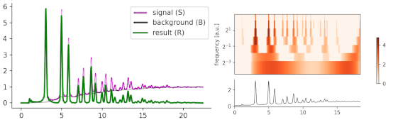
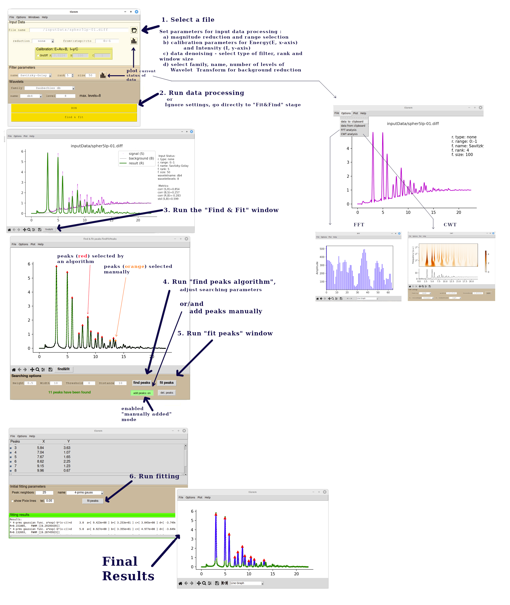

#-----------------------------------------------------------------

#-----------------------------------------------------------------

Before start:
1) install scikit-ued package from:
https://github.com/LaurentRDC/scikit-ued/tree/master

The program needs packages, which should be a part of Python/OS platforms: 
    matplotlib, pywt, xclip, scipy, numpy
    
2) Program usage/manual is given below in figure

#-----------------------------------------------------------------

To start program:

    1) First option, just type:

    $ python3 tlorem.py
    
    or the second option:

    2) make tlorem.py executable:
        $chomod +x tlorem.py
 
    and run:
    $ ./tlorem.py

#-----------------------------------------------------------------
Graphical manuall

#-----------------------------------------------------------------
